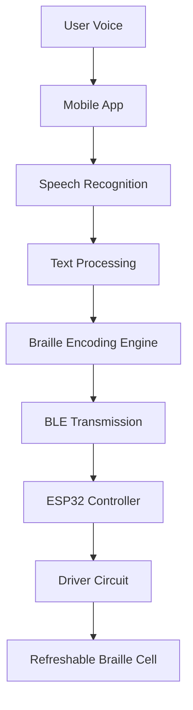

<div align="center">

# Sphoorti — Speech-to-Braille Assistive System

Empowering the visually impaired through real-time speech-to-braille conversion.


</div>

---

# 🌟 Overview

Sphoorti is a **mobile-to-hardware assistive technology platform** designed to convert spoken language or typed text into **refreshable braille output** in real time.

The project combines:

* 📱 A React Native mobile application
* 🔵 Bluetooth Low Energy (BLE) communication
* 🎤 Speech-to-text processing
* 🔣 Braille encoding logic
* ⚡ Embedded driver circuitry
* 🧲 Solenoid-based tactile braille generation

The system is designed to help visually impaired users interact with dynamic spoken content through tactile feedback.

---

# ❗ Problem Statement

Traditional refreshable braille displays are often:

* Extremely expensive
* Difficult to repair
* Bulky and non-portable
* Limited in accessibility for developing regions

Additionally, most systems do not provide seamless real-time speech-to-braille conversion using consumer mobile devices.

Sphoorti aims to create a **low-cost**, **modular**, and **portable** alternative using modern mobile technologies and embedded hardware.

---

# 💡 Proposed Solution

The system workflow is:

1. User speaks into the mobile app
2. Audio is recorded and uploaded
3. Speech is converted into text
4. Text is encoded into standard 6-dot braille patterns
5. Encoded patterns are transmitted over BLE
6. ESP32-based hardware activates the corresponding braille dots
7. The user reads the output tactilely

The app also supports:

* Manual text input
* Direct braille transmission
* Adjustable output timing
* Device reconnection

---

# ✨ Key Features

* 🎤 Real-time voice recording
* ☁️ Cloud-based speech recognition
* 🔣 6-dot braille encoding engine
* 🔵 Bluetooth Low Energy communication
* ⚡ Real-time tactile output
* 📱 Modern mobile UI
* 🔌 ESP32 integration
* 🧠 Automatic number-mode detection
* 🔄 Device reconnection support
* ✍️ Manual text-to-braille conversion
* 🎞️ Animated UI feedback using Lottie
* ♿ Accessibility-focused interaction design

---

# 🧱 System Architecture



---

# 🔩 Hardware Architecture

> *Some hardware details are inferred from the provided schematic and PCB structure.*

The embedded hardware architecture consists of:

* ESP32 BLE-enabled microcontroller
* Braille actuator driver stage
* Power regulation circuitry
* Transistor-based switching network
* Refreshable tactile braille mechanism

---

# 🔣 Braille Cell Architecture

The system currently uses a **single refreshable braille character cell**.

The braille cell follows the standard **3×2 braille matrix**:

```text
1 4
2 5
3 6
```

Each character is encoded into a 6-bit binary sequence:

* `1` → Raised dot
* `0` → Lowered dot

Example mappings:

| Character | Pattern |
| --------- | ------- |
| A         | 100000  |
| B         | 110000  |
| C         | 100100  |

The mobile application sequentially transmits braille characters one at a time.

This architecture was intentionally selected because it:

* Reduces hardware complexity
* Minimizes GPIO usage
* Keeps the prototype affordable
* Simplifies debugging
* Reduces power consumption
* Makes the system easier to reproduce academically

---

# ⚡ Driver Circuit Design

The braille driver circuitry is built around:

* **BD139 (NPN)**
* **BD140 (PNP)**

These operate in a **high-side / low-side switching configuration**.

---

## 🔹 High-Side Switching

BD140 transistors are used as:

* High-side switches
* Current suppliers for the actuator stage

---

## 🔹 Low-Side Switching

BD139 transistors are used for:

* GPIO interfacing
* Current sinking
* Switching control

---

# 🧲 Solenoid Compatibility

The design supports both:

---

## 1️⃣ Three-Terminal Solenoids

Useful for:

* Bidirectional movement
* Latching systems
* Advanced refreshable braille mechanisms

---

## 2️⃣ Two-Terminal Solenoids

Compatible with standard:

* Push solenoids
* Pull solenoids
* Electromagnetic tactile actuators

Advantages:

* Easier availability
* Simpler design
* Lower cost
* Better for prototyping

---

# 🔌 Actuator Operation Flow

For each active braille dot:

1. ESP32 sends control signal
2. BD139 activates
3. BD140 switches the actuator supply
4. Solenoid energizes
5. Braille pin rises mechanically

When disabled:

* Current stops
* Pin retracts via spring/gravity

---

# 📟 Circuit / PCB Discussion

The schematic indicates a modular embedded architecture consisting of:

* Power regulation section
* BLE controller section
* Driver transistor arrays
* Braille actuator connectors
* Indicator LEDs
* Signal routing headers

Observed design principles:

* Modular expansion capability
* Discrete transistor-based driver logic
* Easy debugging through LEDs
* Breadboard-friendly prototyping
* Scalable future architecture

Potential future PCB improvements:

* SMD-based compact layout
* Dedicated driver ICs
* MOSFET-based switching
* Shift-register multiplexing
* Battery management system
* Multi-cell architecture

---

# 🖥️ Software Stack

| Technology           | Purpose                      |
| -------------------- | ---------------------------- |
| React Native         | Mobile application framework |
| Expo                 | Development platform         |
| TypeScript           | Application logic            |
| react-native-ble-plx | BLE communication            |
| expo-av              | Audio recording              |
| Axios                | HTTP communication           |
| Lottie               | UI animations                |
| AssemblyAI           | Speech-to-text               |
| Cloudinary           | Audio hosting                |
| JSON Mapping Engine  | Braille conversion           |
| ESP32 Firmware       | Hardware control             |

---

# 📱 Mobile Application Workflow

## Home Screen

Features:

* BLE scanning
* ESP device discovery
* Device selection
* Connection handling

## Control Screen

Features:

* Voice recording
* Speech transcription
* Manual text input
* Braille transmission
* Speed adjustment
* Stop transmission
* Reconnection logic

---

# 🔵 BLE Communication Logic

The application uses BLE UART-style communication.

## Workflow

1. Scan nearby BLE devices
2. Identify ESP-based devices
3. Establish BLE connection
4. Discover services and characteristics
5. Encode braille patterns
6. Convert to Base64
7. Transmit sequentially

---

## Android Permissions

The app handles:

* `BLUETOOTH_SCAN`
* `BLUETOOTH_CONNECT`
* `ACCESS_FINE_LOCATION`

Required for Android 12+ BLE functionality.

---

# 🔣 Braille Encoding Logic

Braille mappings are stored in:

```text
json/alphabet-map.json
```

Each character maps to a 6-bit tactile representation.

The system also supports:

* Number-mode switching
* Sequential transmission
* End-of-message handling

---

# 📁 Folder Structure

```text
project-root/
│
├── app/
│   ├── (tabs)/
│   │   ├── index.tsx
│   │   ├── controlScreen.tsx
│   │   └── _layout.tsx
│   │
│   └── _layout.tsx
│
├── assets/
│   ├── images/
│   ├── fonts/
│   └── lottie/
│
├── context/
│   └── BLEcontext.tsx
│
├── json/
│   └── alphabet-map.json
│
├── utils/
│   ├── general-functions.js
│   └── styles.js
│
├── constants/
├── hooks/
├── package.json
├── app.json
└── eas.json
```

---

# 📸 UI / User Experience

The application includes:

* Modern dark-themed interface
* Large accessible buttons
* Animated recording indicators
* BLE connection status
* Smooth tactile transmission feedback
* Minimal and distraction-free interaction

Lottie animations provide:

* Recording state feedback
* Upload status
* Transmission progress

---

# 🚀 Installation & Setup

## Prerequisites

* Node.js ≥18
* Expo CLI
* Android device with BLE
* ESP32 hardware

---

## Installation

```bash
git clone https://github.com/your-username/sphoorti.git

cd sphoorti

npm install

npx expo start
```

---

# 📲 Running on Android

The project can run using:

* Expo Go (limited BLE support)
* Development Build (recommended)

Recommended:

```bash
eas build --platform android --profile development
```

---

# 🔗 Hardware Integration

## Connecting the ESP Device

1. Flash compatible firmware to ESP32
2. Power the hardware board
3. Open the mobile application
4. Scan for devices
5. Connect to the ESP
6. Begin speech or text transmission

---

# 🔮 Future Improvements

* Multi-cell braille display
* Full refreshable braille line
* Offline speech recognition
* OCR-to-braille conversion
* AI-powered transcription
* Multi-language braille
* Piezoelectric braille cells
* Compact SMD PCB revision
* Battery-powered operation
* Edge AI processing
* Haptic feedback system
* Wireless firmware updates

---

# 🧩 Engineering Challenges

Major technical challenges include:

* Stable BLE communication
* Solenoid current management
* Real-time synchronization
* Power consumption optimization
* Mechanical tactile precision
* Android BLE permission handling
* Compact hardware scaling

---

# ♿ Accessibility Impact

Sphoorti aims to democratize braille accessibility by:

* Reducing overall hardware cost
* Leveraging smartphones for processing
* Providing portable tactile interaction
* Supporting real-time spoken content access

The project focuses heavily on:

* Educational accessibility
* Low-cost assistive engineering
* Open-source innovation

---

# 🎓 Research & Academic Value

This project demonstrates integration across:

* Mobile development
* Embedded systems
* BLE communication
* Assistive technology
* Speech processing
* Hardware-software co-design
* Human-computer interaction

It serves as a strong academic and research-oriented engineering prototype.

---

# 👥 Contributors

| Role                 | Contributor        |
| -------------------- | ------------------ |
| Software Development | Sibshankar De      |
| Hardware Development | Subhajit Halder    |
| Product Design       | Rounak Mohata      |
| Product Design       | Priyam Chakraborty |
| Product Design       | Gautam Maity       |

---

# 📄 License

This project is licensed under the MIT License.

---

# 🙏 Acknowledgements

Special thanks to:

* React Native community
* Expo ecosystem
* react-native-ble-plx contributors
* AssemblyAI
* Cloudinary
* Open-source accessibility communities

---

# 🌍 Vision

Sphoorti is not just a prototype.

It represents a step toward:

* Affordable assistive technology
* Open-source accessibility hardware
* Democratized braille innovation
* Human-centered embedded engineering

---

> *“Technology becomes truly meaningful when it empowers everyone equally.”*
