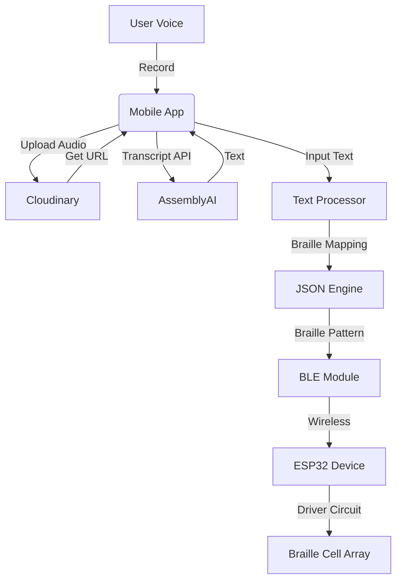

# Sphoorti — Speech-to-Braille Assistive System

> **Empowering the visually impaired through real‑time speech-to-braille conversion.**

[](LICENSE)  
[](https://reactnative.dev/)  
[](https://expo.dev/)  
[](https://github.com/dotintent/react-native-ble-plx)  
[](https://www.assemblyai.com/)

---

## 🌟 Overview

Sphoorti is a **mobile‑to‑hardware assistive technology system** that converts spoken words or typed text into **braille‑ready patterns** and transmits them wirelessly to a **refreshable braille display** via Bluetooth Low Energy (BLE). The entire pipeline—voice capture, cloud‑based speech recognition, braille encoding, and real‑time device control—is orchestrated by a React Native app, making the system portable, affordable, and accessible.

---

## ❗ Problem Statement

Visually impaired individuals often struggle to access dynamic, real‑time written content. Traditional braille displays are expensive, non‑portable, and rely on manual input. Voice‑to‑braille conversion could bridge this gap, but existing solutions are scarce and lack seamless mobile integration.

---

## 💡 Proposed Solution

Sphoorti addresses these gaps by:

1. **Capturing speech** via the mobile microphone.
2. **Transcribing** the audio to text using a cloud speech‑to‑text engine.
3. **Encoding** each character into the standard 6‑dot braille pattern.
4. **Sending** the patterns over BLE to an **ESP32‑based braille driver board**.
5. The driver board **activates the correct braille cells** (solenoids/actuators) in real time, allowing the user to read the spoken content through touch.

The system also supports **manual text input** for non‑vocal scenarios.

---

## ✨ Key Features

- 🎤 **Voice Recording** – high‑quality audio capture with automatic stop.
- ☁️ **Cloud Transcription** – uses AssemblyAI for accurate speech‑to‑text.
- 🔤 **Braille Encoding** – maps A‑Z, 0‑9, and special modes to 6‑dot braille.
- 🔵 **Bluetooth Low Energy** – discovers nearby ESP devices, connects, and streams data.
- ⚡ **Real‑Time Transmission** – sends each braille pattern with configurable speed.
- 📱 **Accessible Mobile UI** – large buttons, haptic feedback, and clear visual cues.
- 🧩 **Manual Text Input** – type any message and send it as braille.
- 📟 **Device Reconnection** – one‑tap reconnect to a previously paired ESP.
- 🧠 **Intelligent Number Handling** – toggles between letter and number modes automatically.
- 🎨 **Smooth Animations** – Lottie‑powered feedback for recording, uploading, and sending.

---

## 🧱 System Architecture



---

## 🔩 Hardware Architecture

*Inferred from the schematic / BOM present in the repository.*

The hardware side consists of an **ESP32** (or ESP‑32‑based BLE module) that receives braille patterns and controls a **multi‑cell braille display**. Key components identified:

- **Voltage Regulation** – 7805 regulator providing 5V logic supply from a 12V input.
- **Braille Dot Drivers** – PNP (BD140) & NPN (BD139) transistor pairs for each dot of every braille cell (observed from the large transistor count in `Sheet_2.png`). This suggests a **direct‑drive matrix**.
- **LED Matrix / Feedback** – common‑anode LED matrix for visual debugging and separate Tx/Rx LEDs.
- **Connectors** – FJ1–FJ5 headers presumably link to the braille cell mechanical assembly.
- **Passive components** – resistors, capacitors for signal conditioning.

> **⚠️ Note:** The exact actuator type (solenoid, piezoelectric, shape‑memory alloy) is not explicitly defined in the provided files. The driver stage uses BD139/BD140 transistors capable of handling moderate current, typical for small solenoids or magnetic latching cells.

### 📟 Circuit / PCB Discussion

The schematic suggests a **modular approach**:
- A **power supply & logic board** (7805, filtering caps, microcontroller).
- A **driver board** populated with transistor pairs for each dot.
- The large number of BD140s (visible in the BOM parts list) indicates a scalable design, possibly supporting **up to 80 braille cells** (6 dots × 80 = 480 drivers). This would be a **full‑page refreshable braille display** concept.

Design choices inferred:
- Use of **PNP transistors for high‑side switching** (common anode configuration).
- Digital signals from the ESP GPIO control the base of the NPN (BD139), which in turn drives the PNP.
- LEDs (LED1–LED3) used as status indicators for power, BLE connection, and data transmission.

Improvements possible:
- Dedicated constant‑current LED/dot drivers (e.g., TLC5940) to reduce component count.
- SMD components for compact, portable design.
- Battery management for standalone operation.

---

## 🖥️ Software Stack

| Technology            | Purpose                              |
|-----------------------|--------------------------------------|
| React Native / Expo   | Cross‑platform mobile framework      |
| TypeScript            | Type‑safe application logic          |
| react‑native‑ble‑plx  | BLE scanning, connecting, data write |
| expo‑av               | Audio recording & playback           |
| axios                 | HTTP client for cloud upload/API     |
| Lottie (lottie‑react‑native) | Animated loaders & feedback   |
| react‑navigation      | Screen routing                       |
| AssemblyAI            | Cloud speech‑to‑text transcription   |
| Cloudinary            | Secure audio storage & retrieval     |
| ESP‑IDF / Arduino     | Firmware for ESP32 (inferred)        |
| Nordic UART Service   | Standard BLE serial emulation        |

---

## 📱 Mobile Application Workflow

1. **Home Screen (`index.tsx`)**  
   - Scans for BLE devices with “ESP” in their name.  
   - Displays discovered devices; tap to connect.  
   - Navigates to Control Screen on successful connection.

2. **Control Screen (`controlScreen.tsx`)**  
   - Shows connected device info.  
   - **Record button**: starts/stop recording (10 s auto‑stop).  
   - **Upload & Transcription**: audio → Cloudinary → AssemblyAI → text.  
   - **Manual text input**: type a message and press send.  
   - **Braille sending**: characters are encoded and sent sequentially over BLE.  
   - **Speed control**: adjust inter‑character delay (3 s – …).  
   - **Stop button**: abort ongoing transmission.

3. **Reconnection**  
   - If the BLE connection drops, the “Reconnect” button re‑establishes the link.

---

## 🔵 BLE Communication Logic

- **Service/Characteristic**: Nordic UART Service (`6E400001-...`) with TX characteristic (`6E400002-...`).  
- **Permissions**: Handles `BLUETOOTH_SCAN`, `BLUETOOTH_CONNECT`, `ACCESS_FINE_LOCATION` on Android 12+.  
- **Data Format**: Braille patterns (6‑char “0”/“1” strings) are **Base64‑encoded** before BLE write.  
- **Connection**: `device.connect()` → `discoverAllServicesAndCharacteristics()`.  
- **Disconnection**: `device.cancelConnection()` and removal from connected list.

*The ESP firmware is expected to decode the 6‑bit pattern and update the corresponding dot state.*

---

## 🔣 Braille Encoding Logic

The file `json/alphabet-map.json` maps **A‑Z** and **digits 0‑9** to a 6‑character string where each character indicates a dot:

- **1** = dot raised  
- **0** = dot lowered  

Dot numbering follows the standard **Braille 6‑dot cell** (top‑left to bottom‑right, `1 2 3 ; 4 5 6`).

**Number mode** is triggered by sending the special prefix `001111` before the first digit (and following numbers do not repeat the prefix).  
The transmission ends with a `#` character.

Example:  
- `"A"` → `"100000"` (dot 1)  
- `"5"` → `"100010"` (dots 1,5)  
- `"hello"` → letters encoded sequentially; the app sends the prefix for the first digit in numbers.

---

## 📁 Folder Structure

```
esp-app/
├── app/                    # Expo Router screens
│   ├── (tabs)/
│   │   ├── _layout.tsx      # Tab layout with header
│   │   ├── index.tsx        # Device scanning & connection
│   │   └── controlScreen.tsx# Main control interface
│   ├── _layout.tsx          # Root layout (provides BLE context)
│   └── +not-found.tsx
├── assets/                 # Images, Lottie animations, fonts
│   ├── images/
│   ├── lottie/
│   └── fonts/
├── components/             # Reusable UI components (ThemedText, etc.)
├── constants/              # Colors, theme
├── context/
│   └── BLEcontext.tsx       # BLE manager, scanning, send/receive logic
├── hooks/                  # useColorScheme, useThemeColor
├── json/
│   └── alphabet-map.json   # Braille pattern mapping
├── utils/
│   ├── general-functions.js # Helpers (sleep, validation)
│   └── styles.js           # Common text styles
├── package.json
├── app.json                # Expo configuration
└── eas.json                # EAS Build settings
```

---

## 📸 Screenshots / UI

*Based on the provided images/assets:*  
- **Home Screen**: Dark background, list of detected ESP devices, scan button.  
- **Control Screen**: Central microphone button, transcription box with progress, speed controls, and reconnect button.  
- **Lottie animations** give visual feedback during recording (`voice-loader.json`), uploading (`upload-loader.json`), and sending (`send-loader.json`).

---

## 🚀 Installation & Setup

### Prerequisites
- Node.js ≥18
- Expo CLI (`npm install -g expo-cli`)
- Expo Go app on Android phone (or development build)
- Bluetooth‑enabled ESP device running compatible firmware

### Steps

```bash
# 1. Clone the repository
git clone https://github.com/your-username/sphoorti.git
cd sphoorti

# 2. Install dependencies
npm install

# 3. Start the Expo development server
npx expo start
```

Scan the QR code with Expo Go (Android) or run on an emulator.

### Android BLE Permissions
The app automatically requests `BLUETOOTH_SCAN`, `BLUETOOTH_CONNECT`, and `ACCESS_FINE_LOCATION` on Android 12+. Ensure location services are enabled on the device for BLE scanning to work.

---

## 🛠️ Running on Android

- **Expo Go** – works for UI testing, but BLE may require a **development build** for full functionality (native module support).  
- **Development Build** – use `eas build --platform android --profile development` to create a custom APK/AAB.  
- **Permissions** – review the `app.json` exported permissions; all needed ones are already declared.

---

## 🔗 Hardware Integration

To connect with your ESP device:

1. Flash the ESP with firmware that listens on the Nordic UART service and interprets incoming 6‑bit braille strings.
2. Power up the ESP and the braille driver board.
3. On the mobile app, tap **Scan Devices** – the ESP should appear with a name containing “ESP”.
4. Tap the device to connect; the app automatically discovers services and shows the control screen.
5. Start recording or typing – the data will be sent in real time.

*For testing without a full driver board, you can monitor the ESP’s serial output to see the received patterns.*

---

## 🔮 Future Improvements

- [ ] **Multi‑language braille** support (grade 2, contracted braille).
- [ ] **Offline speech recognition** (e.g., Vosk, Whisper) to remove cloud dependency.
- [ ] **OCR → Braille** – point camera at text and convert.
- [ ] **Haptic & audio cues** for app feedback to assist visually impaired users.
- [ ] **Bi‑directional communication** – receive device status, battery level.
- [ ] **Custom PCB design** with integrated driver ICs, smaller form factor.
- [ ] **Dynamic refreshable braille** using piezoelectric actuators or micro‑solendoids.
- [ ] **Cloud sync** for settings and history.
- [ ] **Edge AI** – run tiny‑ML on ESP for wake‑word detection.
- [ ] **Better actuator drivers** – shift registers + constant‑current sinks to reduce GPIO usage.
- [ ] **Secure API key management** (environment variables instead of hardcoded keys).

---

## 🧩 Challenges Faced

- *BLE reliability* – ensuring stable connection and data delivery over long streams.
- *Real‑time performance* – balancing audio upload, transcription turnaround, and braille rendering latency.
- *Hardware scalability* – driving hundreds of dots with limited GPIO; multiplexing strategies needed.
- *Android permission labyrinth* – proper runtime requests for BLE + location on API ≥31.
- *Cross‑platform compatibility* – iOS BLE limitations (MFi) push focus to Android.

---

## ♿ Accessibility Impact

Sphoorti democratizes access to real‑time information for the visually impaired:
- Makes any spoken announcement, lecture, or conversation instantly readable.
- Low‑cost compared to commercial braille displays (because the heavy lifting is offloaded to the phone).
- Open‑source nature invites community collaboration to continuously improve.

---

## 🎓 Research / Academic Value

This project demonstrates:
- Full‑stack integration of **mobile, cloud, and embedded systems**.
- Practical use of **BLE UART** for IoT assistive technology.
- **Speech‑to‑braille pipeline** with configurable timing for tactile readability.
- Scalable driver architecture for **large braille arrays**.

It can serve as a baseline for research in **human‑computer interaction**, **accessibility engineering**, and **DIY assistive device design**.

---

## 👥 Contributors

- **Hardware** – Subhajit Halder  
- **Software** – Sibshankar De  
- **Product Design** – Rounak Mohata, Priyam Chakraborty, Gautam Maity  

---

## 📄 License

This project is licensed under the **MIT License** – see the [LICENSE](LICENSE) file for details.

---

## 🙏 Acknowledgements

- **AssemblyAI** for speech‑to‑text API.  
- **Cloudinary** for media storage.  
- **react‑native‑ble‑plx** for robust BLE integration.  
- **Expo** for streamlined cross‑platform development.  
- The vibrant **open‑source accessibility community**.

---

## 📚 Learn More

- [Expo documentation](https://docs.expo.dev/) – learn fundamentals or go into advanced topics with guides.  
- [Learn Expo tutorial](https://docs.expo.dev/tutorial/introduction/) – step‑by‑step tutorial for building universal apps.

## 🌐 Join the Community

- [Expo on GitHub](https://github.com/expo/expo) – view the open source platform and contribute.  
- [Expo Discord](https://chat.expo.dev) – chat with Expo users and ask questions.

---

> *“The best and most beautiful things in the world cannot be seen or even touched — they must be felt with the heart.”* — Helen Keller  
> *But with Sphoorti, they can be felt with your fingertips.*
```
